

  

  <ul class="nav nav-list bs-docs-sidenav" data-spy="affix" data-offset-top="200" data-offset-bottom="260">
   <li><a href="#published">Conference Publications</a></li>
   <li><a class="subhead" href="#2024_b"> 2024 </a></li>
   <li><a class="subhead" href="#2024_c"> 2024 </a></li>
	<li><a class="subhead" href="#2022_c"> 2022 </a></li>
	<li><a class="subhead" href="#2021_c"> 2021 </a></li>
   <li><a class="subhead" href="#2020_c"> 2020 </a></li>
   <li><a class="subhead" href="#2019_c"> 2019 </a></li>
   <li><a class="subhead" href="#2018_c"> 2018 </a></li>
   <li><a class="subhead" href="#2016_c"> 2016 </a></li>
   <li><a class="subhead" href="#2014_c"> 2014 </a></li>
   <li><a class="subhead" href="#2013_c"> 2013 </a></li>
   <li><a class="subhead" href="#2012_c"> 2012 </a></li>
   <li><a class="subhead" href="#2011_c"> 2011 </a></li>
   <li><a class="subhead" href="#2009_c"> 2009 </a></li>
   <li><a class="subhead" href="#2007_c"> 2007 </a></li>
   <li><a class="subhead" href="#2006_c"> 2006 </a></li>
	<li><a href="#refereed"> Journal Publications</a></li>
	<li><a class="subhead" href="#2024"> 2024 </a></li>
   <li><a class="subhead" href="#2015"> 2015 </a></li>
   <li><a class="subhead" href="#2013"> 2013 </a></li>
   <li><a class="subhead" href="#2011"> 2011</a></li>
   <li><a class="subhead" href="#2010"> 2010 </a></li>
   <li><a class="subhead" href="#2006"> 2006 </a></li>
   <li><a href="#inreview"> Under Review and Pre-prints</a></li>	  
   <li><a class="subhead" href="#2024_r"> 2024 </a></li>
    </ul>
    

    

	
	

	
	<section id="Other">

   

      <h3>Moments</h3>
   

   

      

         

            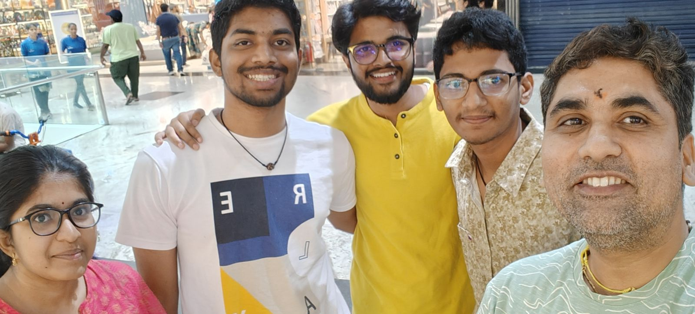
            
UG '24 batch.

         

         

            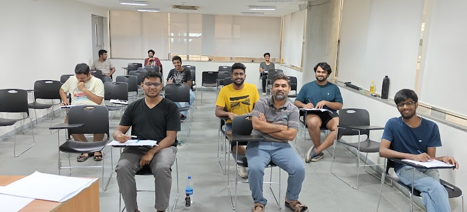                      
            
Convex Optimization: Algorithms '24 batch.

         

      

      <a class="left carousel-control" href="#main-carousel" data-slide="prev">‹</a>
	

   

      <h3>Awards</h3>
   

	<h4>2021</h4>
   

         <h4 style="font-size: 17px;"><mark style="background-color: white; color:red;">PhD Fellowship</mark></h4>
          
         Our PhD student selected as one among the 4 Indian receipients of the early-stage (4 Yrs fellowship) <mark style="background-color: white; color:red;"><b><a href="https://research.google/outreach/phd-fellowship/recipients/?category=2021">Google PhD Fellowship '21</a></b></mark>; also selected for 
         <mark style="background-color: white; color:red;"><b><a href="https://pmrf.in">PMRF '21</a></b></mark>.
   

	</section>
   <section id="published">
      

         <h3>Conference Publications</h3>
      
	
	   <section id="2024_b">
         <h3>2024</h3>
                      
         

            

               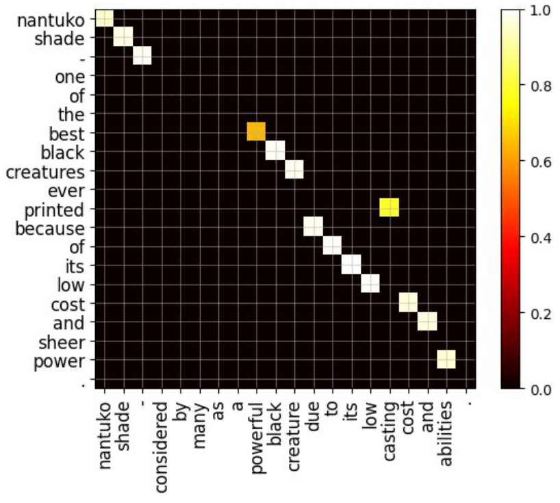
            

            

               <h4 style="font-size: 17px;">Submodular Framework for Structured-Sparse Optimal Transport</h4>
                
               
<b>Piyushi Manupriya, Pratik Jawanpuria, Karthik S. Gurumoorthy, J Saketha Nath, Bamdev Mishra</b>

               <a href="https://arxiv.org/pdf/2406.04914f"><b><mark style="background-color: white; color:red;">ICML</mark></b></a> | 
               <a href="https://github.com/piyushi-0/Sparse-UOT"><b>Code</b></a>
            
 
         

         
        
         

            

               
            

            

               <h4 style="font-size: 17px;">Consistent Optimal Transport with Empirical Conditional Measures</h4>
                
               
<b>Piyushi Manupriya, Rachit Keerti Das, Sayantan Biswas, J Saketha Nath</b>

               <a href="https://arxiv.org/pdf/2305.15901.pdf"><b><mark style="background-color: white; color:red;">AISTATS</mark></b></a> | 
               <a href="https://github.com/atmlr-lab/COT"><b>Code</b></a>
            
           
         

      </section>
	   <section id="2022_c">
         <h3>2022</h3>
                      
         

            

               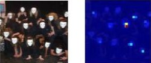   
            

            

               <h4 style="font-size: 17px;">Improving Attribution Methods by Learning Submodular Functions</h4>
                
               
<b>Piyushi Manupriya, Tarun Ram Menta, SakethaNath Jagaralpudi, Vineeth N Balasubramanian</b>

               <a href="https://arxiv.org/pdf/2104.09073.pdf"><b><mark style="background-color: white; color:red;">AISTATS</mark></b></a>  | 
               <a href="https://piyushi-0.github.io/SEA-NN/"><b>Project Webpage</b></a>
            

            

         

      </section>
	   <section id="2021_c">
         <h3>2021</h3>
                      
         

            
               
               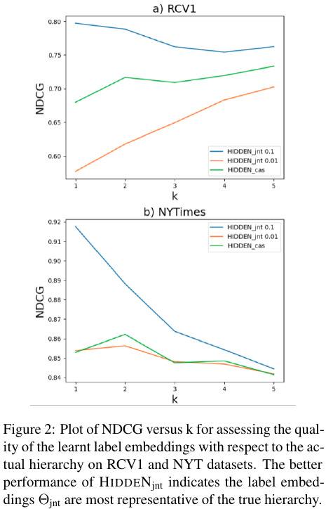
            

            

               <h4 style="font-size: 17px;">Joint Learning of Hyperbolic Label Embeddings for Hierarchical Multi-label Classification</h4>
                
               
<b>Soumya Chatterjee, Ayush Maheshwari, Ganesh Ramakrishnan and SakethaNath Jagaralpudi</b>

               <a href="https://www.aclweb.org/anthology/2021.eacl-main.247/"><b><mark style="background-color: white; color:red;">EACL</mark></b></a>
            

            

         

      </section>
      <section id="2020_c">
         <h3>2020</h3>
                      
         

            

               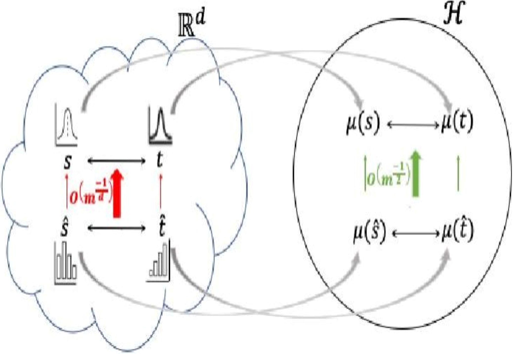
            

            

               <h4 style="font-size: 17px;">Statistical Optimal Transport posed as Learning Kernel Embedding</h4>
                
               
<b>J. Saketha Nath and Pratik Jawanpuria</b>

               <a href="https://papers.nips.cc/paper/2020/hash/c8ecfaea0b7e3aa83b017a786d53b9e8-Abstract.html"><b><mark style="background-color: white; color:red;">NeurIPS</mark></b></a> | 
	            <a href="https://youtu.be/eivYBek7Yog"><b>3 mins Video</b></a> | 
               <a href="https://github.com/pratikjawanpuria/statistical-optimal-transport-posed-as-learning-kernel-embeddings"><b>Code</b></a>
            

            

         

      </section>
      <section id="2019_c">
         <h3>2019</h3>
                      
         

            
     
               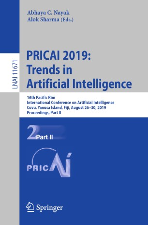
            

            

               <h4 style="font-size: 17px;">Optimizing DNN Architectures for High Speed Autonomous Navigation in GPS Denied Environments on Edge Devices</h4>
                
               
<b>Prafull Prakash, Chaitanya Murti, J. Saketha Nath and Chiranjib Bhattacharyya</b>

               <a href="https://link.springer.com/chapter/10.1007%2F978-3-030-29911-8_36"><b><mark style="background-color: white; color:red;">PRICAI(2)</mark></b></a>
            

            

         

      </section>
      <section id="2018_c">
         <h3>2018</h3>
                      
         

            
 
               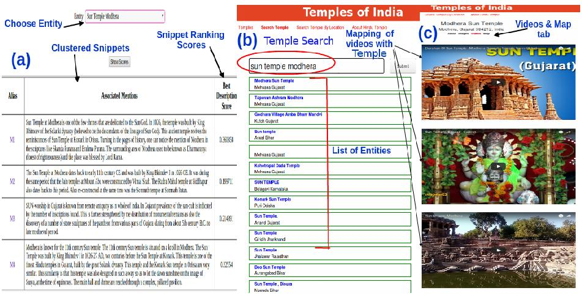
            

            

               <h4 style="font-size: 17px;">Entity Resolution and Location Disambiguation in Ancient Hindu Temples Domain using Web Data</h4>
                
               
<b>Ayush Maheshwari, Vishwajeet kumar, Ganesh Ramakrishnan and J. Saketha Nath</b>

               <a href="https://www.cse.iitb.ac.in/~ganesh/papers/naacl18-demo.pdf"><b><mark style="background-color: white; color:red;">NAACL-HLT(demo track)</mark></b></a>
            

            

         

      </section>
      <section id="2016_c">
         <h3>2016</h3>
                      
         

            

               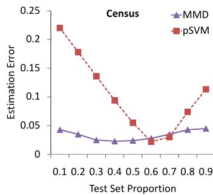
            

            

               <h4 style="font-size: 17px;">Privacy-preserving Class Ratio Estimation</h4>
                
               
<b>Arun Iyer, Saketha Nath J and Sunita Sarawagi</b>

               <a href="http://www.kdd.org/kdd2016/papers/files/rfp1172-iyerA.pdf"><b><mark style="background-color: white; color:red;">KDD</mark></b></a>
            

            

         

      </section>
      <section id="2014_c">
         <h3>2014</h3>
                      
         

            

               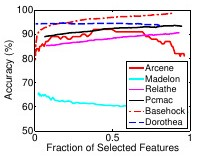
            

            

               <h4 style="font-size: 17px;">On p-norm Path Following in Multiple Kernel Learning for Non-linear Feature Selection</h4>
                
               
<b>Pratik J., Manik Varma and Saketha Nath J</b>

               <a href="http://jmlr.org/proceedings/papers/v32/jawanpuria14.pdf"><b><mark style="background-color: white; color:red;">ICML</mark></b></a>
            

         

         

         

            

               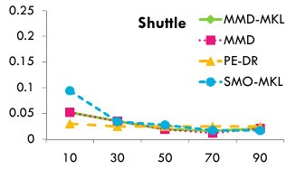
            

            

               <h4 style="font-size: 17px;">Maximum Mean Discrepancy for Class Ratio Estimation: Convergence Bounds and Kernel Selection</h4>
                
               
<b>Arun Iyer, Saketha Nath J and Sunita Sarawagi</b>

               <a href="http://jmlr.org/proceedings/papers/v32/iyer14.pdf"><mark style="background-color: white; color:red;"><b>ICML</b></mark></a> | <a href="https://github.com/aruniyer/CRE"><b>Code</b></a>
            

            

         

      </section>
      <section id="2013_c">
         <h3>2013</h3>
                      
         

            

               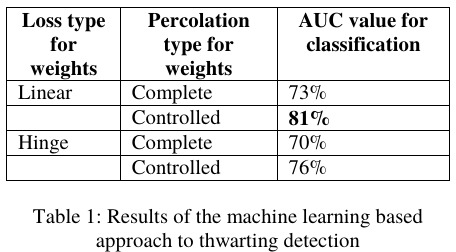
            

            

               <h4 style="font-size: 17px;">Detecting Turnarounds in Sentiment Analysis: Thwarting</h4>
                
               
<b>Prafull Prakash, Chaitanya Murti, J. Saketha Nath and Chiranjib Bhattacharyya</b>

               <a href="https://www.aclweb.org/anthology/P13-2149/"><b><mark style="background-color: white; color:red;">ACL short papers</mark></b></a>
            

            

         

      </section>
      <section id="2012_c">
         <h3>2012</h3>
                      
         

            

               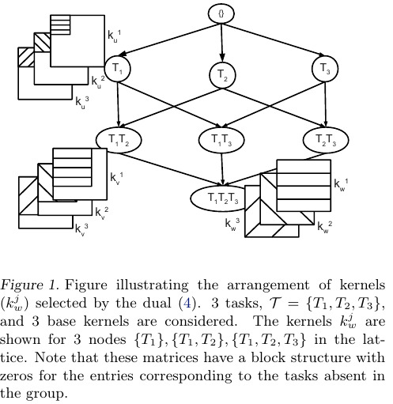
            

            

               <h4 style="font-size: 17px;">A Convex Feature Learning Formulation for Latent Task Structure Discovery</h4>
                
               
<b>Pratik J., and J. Saketha Nath</b>

               <a href="http://arxiv.org/abs/1206.4611"><b><mark style="background-color: white; color:red;">ICML</mark></b></a>
            

            

         

      </section>
      <section id="2011_c">
         <h3>2011</h3>
                      
         

            

               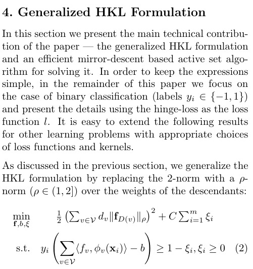
            

            

               <h4 style="font-size: 17px;">Efficient Rule Ensemble Learning using Hierarchical Kernels</h4>
                
               
<b>Pratik J., J. Saketha Nath and Ganesh R</b>

               <a href="http://www.icml-2011.org/papers/143_icmlpaper.pdf"><b><mark style="background-color: white; color:red;">ICML</mark></b></a> | <a href="http://www.cse.iitb.ac.in/~pratik.j/REL-HKL.tar.gz"><b>Code</b></a>
            

         

         

         

            

               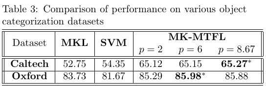
            

            

               <h4 style="font-size: 17px;">Multi-task Multiple Kernel Learning</h4>
                
               
<b>Pratik J., and J. Saketha Nath</b>

               <a href="http://www.iith.ac.in/~saketha/research/mtmkl.pdf"><b><mark style="background-color: white; color:red;">SDM</mark></b></a> | <a href="http://www.iith.ac.in/~saketha/research/MTFL.tgz"><b>Code</b></a>
            

            

         

      </section>
      <section id="2009_c">
         <h3>2009</h3>
                      
         

            

               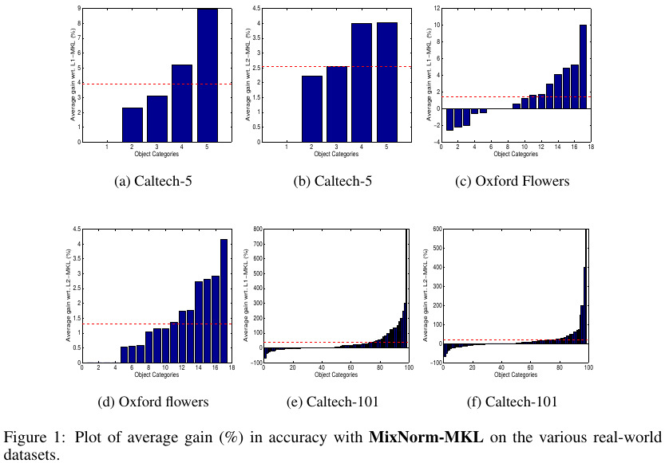
            

            

               <h4 style="font-size: 17px;">On the Algorithmics and Applications of a Mixed-norm based Kernel Learning Formulation</h4>
                
               
<b>J. Saketha Nath, G. Dinesh, S. Raman, C. Bhattacharyya, A. Ben-Tal, K. R. Ramakrishnan</b>

               <a href="http://papers.nips.cc/paper/3880-on-the-algorithmics-and-applications-of-a-mixed-norm-based-kernel-learning-formulation.pdf"><b><mark style="background-color: white; color:red;">NIPS</mark></b></a>
            

         

         
           
         

            

               
            

            

               <h4 style="font-size: 17px;"> Interval Data Classification under Partial Information: A Chance-Constraint Approach</h4>
                
               
<b>S. Bhadra, J. Saketha Nath, A. Ben-Tal and C. Bhattacharyya</b>

               <a href="https://link.springer.com/chapter/10.1007/978-3-642-01307-2_21"><b><mark style="background-color: white; color:red;">PAKDD [Best Paper-Runner Up]</mark></b></a> | <a href="http://www.iith.ac.in/~saketha/research/pakdd09slides.pdf"><b>Slides</b></a>
            

            

         

      </section>
      <section id="2007_c">
         <h3>2007</h3>
                      
         

            

               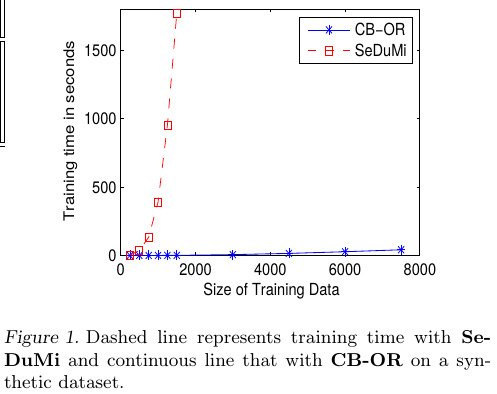
            

            

               <h4 style="font-size: 17px;">Focussed Crawling with Scalable Ordinal Regression Solvers</h4>
                
               
<b>R. Babaria, J. Saketha Nath, S. Krishnan, Sivaramakrishnan, C. Bhattacharyya and M. N. Murty</b>

               <a href="https://icml.cc/imls/conferences/2007/proceedings/papers/211.pdf"><b><mark style="background-color: white; color:red;">ICML</mark></b></a> | <a href="http://www.iith.ac.in/~saketha/research/icml07slides"><b>Slides</b></a> | <a href="http://www.iith.ac.in/~saketha/research/icml07poster"><b>Poster</b></a>
            

         

         
 
         

            
  
               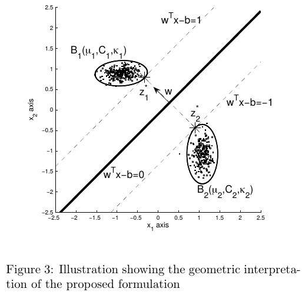
            

            

               <h4 style="font-size: 17px;">Maximum Margin Classifiers with Specified False Positive and False Negative Error Rates</h4>
                
               
<b>J. Saketha Nath and C. Bhattacharyya</b>

               <a href="http://epubs.siam.org/doi/pdf/10.1137/1.9781611972771.4"><b><mark style="background-color: white; color:red;">SDM</mark></b></a>
            

            

         

      </section>
      <section id="2006_c">
         <h3>2006</h3>
                      
         

            

               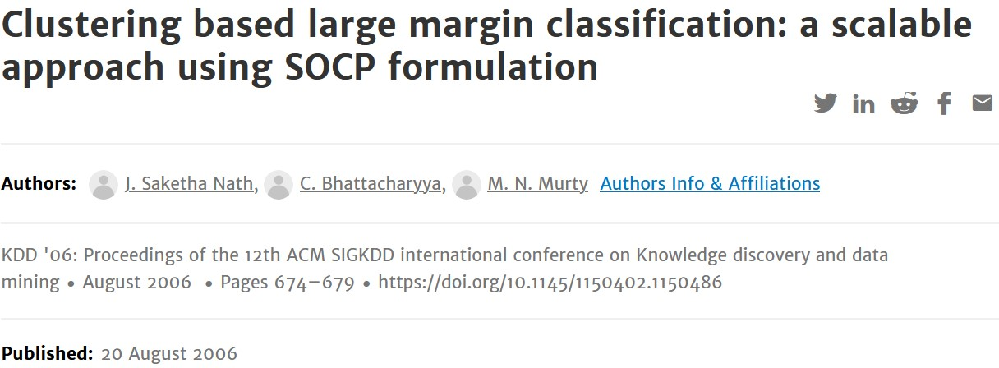
            

            

               <h4 style="font-size: 17px;">Clustering Based Large Margin Classification: A Scalable Approach using SOCP Formulation</h4>
                
               
<b>J. Saketha Nath, C. Bhattacharyya and M. N. Murty</b>

               <a href="http://portal.acm.org/ft_gateway.cfm?id=1150486&type=pdf&coll=&dl=ACM&CFID=15151515&CFTOKEN=6184618"><b><mark style="background-color: white; color:red;">SIGKDD</mark></b></a>
            

         

      </section>
   </section>
   

   <section id="refereed">
      

         <h3>Journal Publications</h3>
      

      <section id="2024">
          
         <h3>2024</h3>
          
         

               

               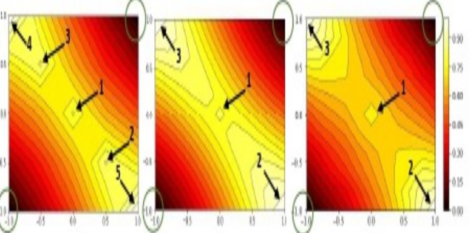
            

            

               <h4 style="font-size: 17px;">MMD-Regularized Unbalanced Optimal Transport</h4>
                
               
<b>Piyushi Manupriya, Jagarlapudi SakethaNath, Pratik Jawanpuria</b>

               <a href="https://openreview.net/forum?id=eN9CjU3h1b"><mark style="background-color: white; color:red;"><b>TMLR</b></mark></a>
            

         

         

         

            

               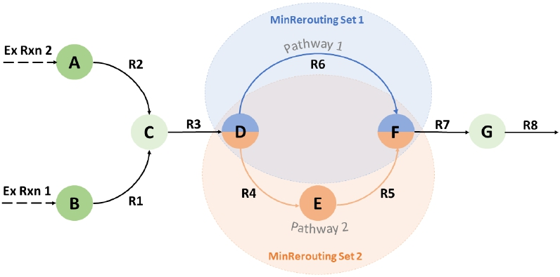
            

            

               <h4 style="font-size: 17px;">Understanding flux switching in metabolic networks through an analysis of synthetic lethals</h4>
                
               
<b>Karthik Raman, Sowmya Manojna Narasimha, Tanisha Malpani, Omkar Mohite, and Saketha Nath</b>

               <a href=""><mark style="background-color: white; color:red;"><b>Systems Biology and Applications</b></mark></a>
            

         

         

      </section>
      <section id="2015">
          	 
         <h3>2015</h3>
          
         

            

               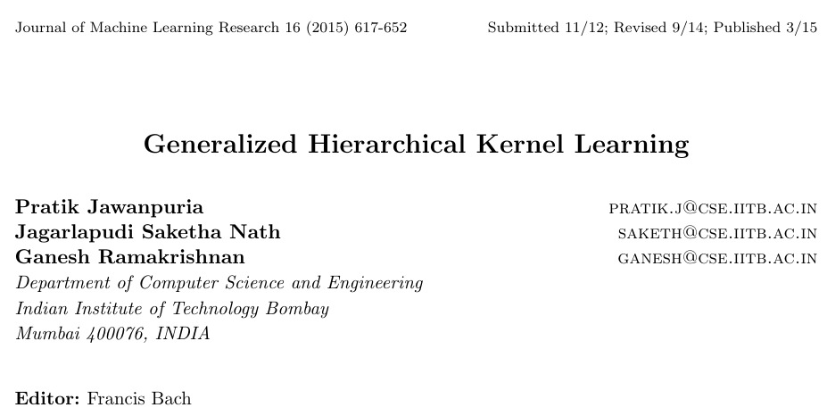
            

            

               <h4 style="font-size: 17px;">Generalized Hierarchical Kernel Learning</h4>
                
               
<b>Pratik Jawapuria, J. SakethaNath and Ganesh Ramakrishnan</b>

               <a href="https://jmlr.org/papers/volume16/jawanpuria15a/jawanpuria15a.pdf"><mark style="background-color: white; color:red;"><b>JMLR</b></mark></a> vol. 16, Pg. 617-652, Mar 2015.
            

         

      </section>
      <section id="2013">
          
         <h3>2013</h3>
          
         

            

               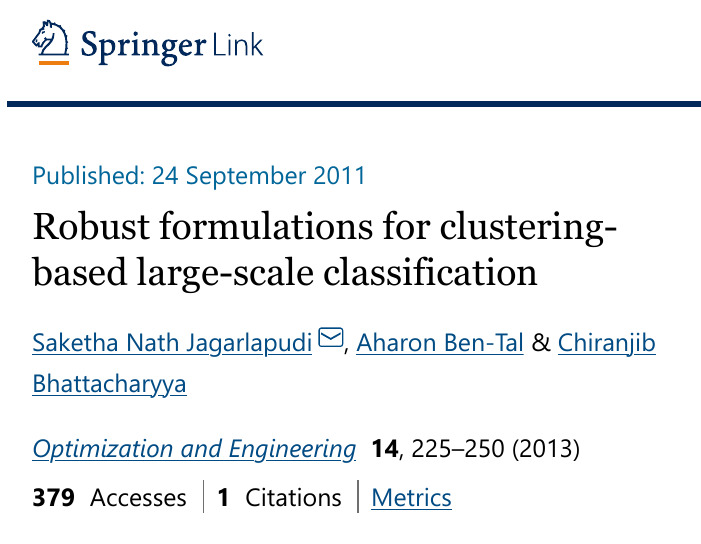
            

            

            <h4 style="font-size: 17px;">Robust formulations for clustering-based large-scale classification</h4>
                	
               
<b>J. Saketha Nath, A. Ben-Tal and C. Bhattacharyya</b>

               <a href="https://link.springer.com/article/10.1007/s11081-011-9166-y"><mark style="background-color: white; color:red;"><b>Journal of Optimization & Engg.</b></mark></a> vol. 14(2), Pg. 225-250, June 2013 | <a href="http://www.iith.ac.in/~saketha/research/mlj09code.tgz"><b>Code</b></a> | <a href="https://www.iith.ac.in/~saketha/research/cbsocp.html"><b>More</b></a>
            

         

      </section>
      <section id="2011">
          
         <h3>2011</h3>
          
         

            

               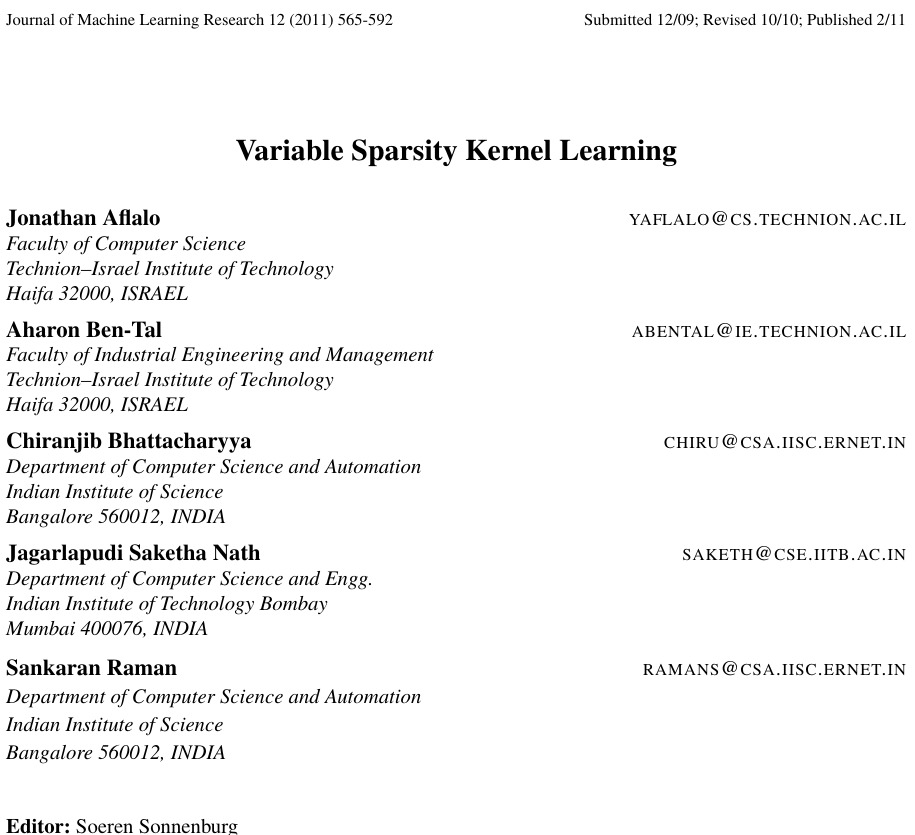
            

         

         <h4 style="font-size: 17px;">Variable Sparsity Kernel Learning</h4>
             
            
<b>J. Aflalo, A. Ben-Tal, C. Bhattacharyya, J. Saketha Nath and S. Raman</b>

            <a href="http://www.jmlr.org/papers/volume12/aflalo11a/aflalo11a.pdf"><mark style="background-color: white; color:red;"><b>JMLR</b></mark></a> vol. 12, Pg. 565-592, 2011 | <a href="http://www.iith.ac.in/~saketha/research/jmlr10code.tgz"><b>Code</b></a>
            

         

      </section>
      <section id="2010">
          
         <h3>2010</h3>
          
         

            

               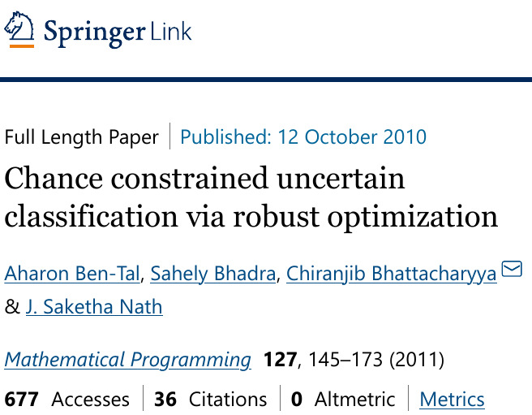
            

         

         <h4 style="font-size: 17px;">Chance Constrained Uncertain Classification via Robust Optimization</h4>
             
            
<b>A. Ben-Tal, S. Bhadra, C. Bhattacharyya and J. Saketha Nath</b>

            <a href="https://link.springer.com/article/10.1007/s10107-010-0415-1"><mark style="background-color: white; color:red;"><b>Mathematical Programming Series B</b></mark></a> (special issue on Machine Learning), vol. 127(1), Pg. 145-173, 2010       
            

         

      </section>
      <section id="2006">
          
         <h3>2006</h3>
          
         

            

               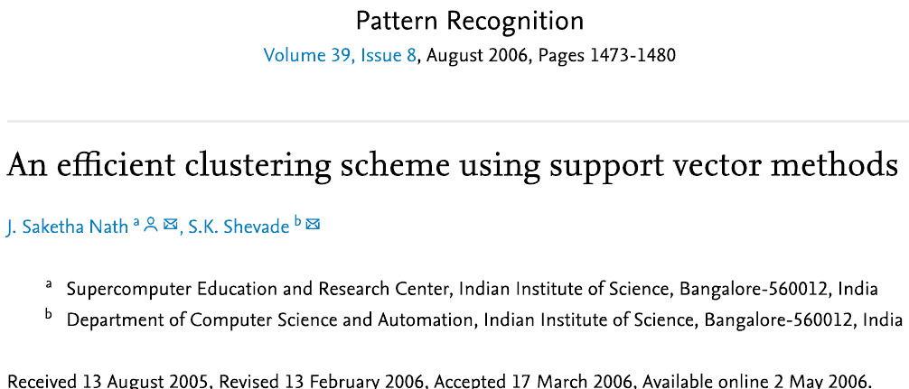
            

         

         <h4 style="font-size: 17px;">An efficient clustering scheme using support vector methods</h4>
             
            
<b>A. Ben-Tal, S. Bhadra, C. Bhattacharyya and J. Saketha Nath</b>

            <a href="https://www.sciencedirect.com/science/article/abs/pii/S0031320306001257"><mark style="background-color: white; color:red;"><b>Pattern Recognition</b></mark></a> vol. 39(8), Pg. 1473-1480, 2006 | <a href="http://www.iith.ac.in/~saketha/research/PRcode.tgz"><b>Code</b></a>
            

         

      </section>
   </section>
   

 

