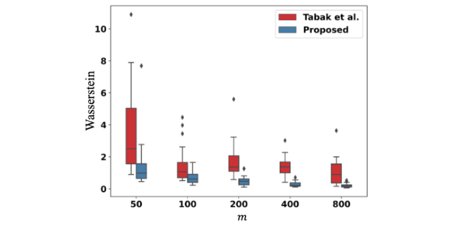
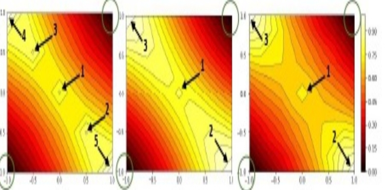

<body>
   

      

         

            

               

                  

                     
                     

                        <h4>NeurIPS 2020: Statistical Optimal Transport posed as learning Kernel Mean Embedding</h4>
                        

                     

                  

                  

                                           
                     

                        <h4>AISTATS 2024: Consistent Optimal Transport with Empirical Conditional Measures</h4>
                        <!-- -->
                        

                     

                  

                  

                                           
                     

                        <h4>TMLR 2024: MMD-Regularized Unbalanced Optimal Transport</h4>
                        <!-- -->
                        

                     

                  
                     
                  

                                           
                     

                        <h4>AISTATS 2022: Submodular Ensembled Attribution for Neural Networks</h4>
                        <!-- -->
                        

                     

 Test

                 

               

               <a class="left carousel-control" href="#main-carousel" data-slide="prev">‹</a>
               <a class="right carousel-control" href="#main-carousel" data-slide="next">›</a>
            

         

      

      

      

         

            

               <h4>This website belongs to the ATMLR lab supervised by <a href="http://www.iith.ac.in/~saketha">Dr J. SakethaNath</a>.  
               </h4>
                
            

            

               

               <h2 class="centered">Recent News</h2>
               

            

			

<!-- This might be hacky, need to investigate further -->



  <h5> 
	{{publication.date | date: "%B %Y" }}
  </h5>
<h4 class="feature-heading">
    "{{publication.title}}"
    
Accepted at {{publication.venue}}!

</h4>

Read the paper at 
<a href="{{publication.pdfurl}}">here</a>.

 

 


			


  <h5> 
	{{publication.date | date: "%B %Y" }}
  </h5>
<h4 class="feature-heading">
    "{{publication.title}}"
    
Accepted at {{publication.venue}}!

</h4>

Read the paper at 
<a href="{{publication.pdfurl}}">here</a>.

 

 


   

</body>
